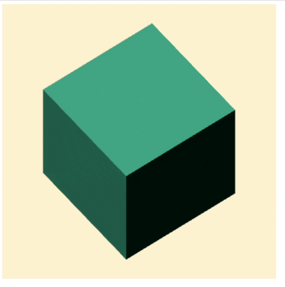
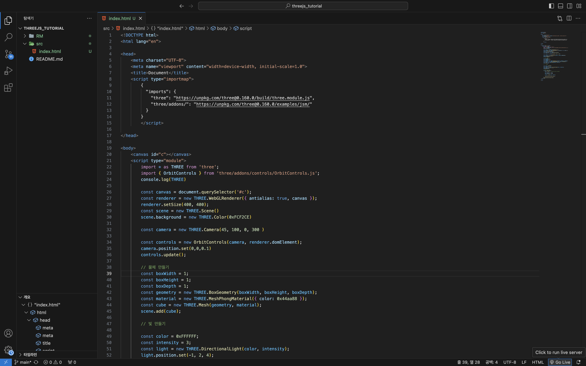

# THREEJS

## 모든것은 박스로 부터 시작
> [!NOTE]
> 실습 코드 



### 📄 index.html

```html
<!DOCTYPE html>
<html lang="en">

<head>
    <meta charset="UTF-8">
    <meta name="viewport" content="width=device-width, initial-scale=1.0">
    <title>Document</title>
    <script type="importmap">
      {
        "imports": {
          "three": "https://unpkg.com/three@0.160.0/build/three.module.js",
          "three/addons/": "https://unpkg.com/three@0.160.0/examples/jsm/"
        }
      }
    </script>
</head>

<body>
    <canvas id="c"></canvas>
    <script type="module">
        import * as THREE from 'three';
        import { OrbitControls } from 'three/addons/controls/OrbitControls.js';
        console.log(THREE)

        const canvas = document.querySelector('#c');
        const renderer = new THREE.WebGLRenderer({ antialias: true, canvas });
        renderer.setSize(400, 400);
        const scene = new THREE.Scene()
        scene.background = new THREE.Color(0xFCF2CE)

        const camera = new THREE.Camera(45, 100, 0, 300 )

        const controls = new OrbitControls(camera, renderer.domElement);
        camera.position.set(0,0,0.1)
        controls.update();
        
        // 물체 만들기
        const boxWidth = 1;
        const boxHeight = 1;
        const boxDepth = 1;
        const geometry = new THREE.BoxGeometry(boxWidth, boxHeight, boxDepth);
        const material = new THREE.MeshPhongMaterial({ color: 0x44aa88 });
        const cube = new THREE.Mesh(geometry, material);
        scene.add(cube);

        // 빛 만들기
        const color = 0xFFFFFF;
        const intensity = 3;
        const light = new THREE.DirectionalLight(color, intensity);
        light.position.set(-1, 2, 4);
        scene.add(light);

        // 반복 렌더링 작업
        function render(time) {
            time *= 0.001;  // convert time to seconds

            cube.rotation.x = time;
            cube.rotation.y = time;

            renderer.render(scene, camera);

            requestAnimationFrame(render);
        }
        requestAnimationFrame(render);
    </script>
</body>

</html>
```
박스를 만드는 실습이다.

> [!TIP]
> 하단 오른쪽을 확인하면 Go Live가 보인다



그림과 같이 ```src/tutorial_01```폴더에 ```index.html```을 생성한 후  
실습 코드를 넣어 [live server](./RM_01.md#LiveServer)를 실행 하면 

http://127.0.0.1:5500/src/tutorial_01/index.html로 접속시 롹인해 볼 수 있다.


## 🍝 코드 분석 
### 라이브러리 가져오기
```html
<script type="importmap">
  {
    "imports": {
      "three": "https://unpkg.com/three@0.160.0/build/three.module.js",
      "three/addons/": "https://unpkg.com/three@0.160.0/examples/jsm/"
    }
  }
</script>
```
이부분은 threejs 라이브러리를 가져오기 위한 스크립트 이다.

### 환경 설정
```html
<body>
    <canvas id="c"></canvas>
    <script> {여기는 threejs 코드부분이 들어갑니다} </script>
</body>
```
threejs는 ```canvas```라는 그림판에 그림을 그리는 식으로 작동하기에 threejs를 그릴 canvas를 준비해야 한다

```canvas```에 대한  자세한 설명은 [여기](https://developer.mozilla.org/ko/docs/Web/API/Canvas_API/Tutorial/Basic_usage)를 참고 바란다
```js
// 1
import * as THREE from 'three';
import { OrbitControls } from 'three/addons/controls/OrbitControls.js';
console.log(THREE)
// 2
const canvas = document.querySelector('#c');
const renderer = new THREE.WebGLRenderer({ antialias: true, canvas });
renderer.setSize(400, 400);
// 3
const scene = new THREE.Scene()
scene.background = new THREE.Color(0xFCF2CE)

// 4
const camera = new THREE.Camera(45, 100, 0, 300 )
const controls = new OrbitControls(camera, renderer.domElement);
camera.position.set(0,0,0.1)
controls.update();

```

1. 상위의 ```import```는 threejs를 사용하기 위해 라이브러리를 가져와 선언한 부분이다  
이와 같은 방식으로 ```js```에서는 라이브러리를 불러와 사용한다  

2. 상위의 ```body```테그에 있는```canvas```를 가져와 Threejs renderer에 사용할 엘리먼트로 만들어 준다  

3. ```scene``` 화면을 나타네기 위한 공간을 만든다

4. ```camera```를 만드는 과정이다 카메라 종류의경우 PerspectiveCamera 와 OrthographicCamera 카메라가 있으며 우리가 생각하는 시야와 동일한 PerspectiveCamera의 카메라를 사용하여 나타네준다  
```OrbitControls``` 마우스의 클릭 및 이동으로 카메라를 제어하는 편리하게 쓸수 있게 하는 설정이다 
> [!WARNING]
> ```camera.position```을 세팅해 주어야 한다


#### THREE JS의 구조

출처 : https://threejs.org/

Threejs를 상위의 그림과 같이 하나의 장면을 만들기 위하여 Renderer, Camera, Scene의 경우는 필수 적이다.  
이와 같은 구조를 가지고 있으며 다음으로 넘어갈때마다 더 자세히 설명할 예정이다

###

### 물체 생성
```js
// 1
const boxWidth = 1;
const boxHeight = 1;
const boxDepth = 1;
const geometry = new THREE.BoxGeometry(boxWidth, boxHeight, boxDepth);

// 2
const material = new THREE.MeshPhongMaterial({ color: 0x44aa88 });

// 3
const cube = new THREE.Mesh(geometry, material);
scene.add(cube);

// 4
const color = 0xFFFFFF;
const intensity = 3;
const light = new THREE.DirectionalLight(color, intensity);
light.position.set(-1, 2, 4);
scene.add(light);
```
> [!IMPORTANT]
> r3f링크에 설명에 대한 부분은 추후 threejs용도로 새로 만들예정이다

1. ```Geometry```는 물체의 형태(특징)를 나타네는 것이다  
[여기](https://github.com/liebespaar93/r3f/blob/main/README/RM_6.md)를 확인하면 어떠한 모형들이 있는지 확인이 가능하다

2. ```material```은 물체의 표면 재질을 결한다  
[여기](https://github.com/liebespaar93/r3f/blob/main/README/RM_7.md)를 확인하면 어떠한 제질들이 있는지 확인이 가능하다  
하지만 대부분은 빛을 인식하고 표현할 수 있는 특정 제질만 많이 사용할 예정이다 

3. ```mesh``` 와 ```group```은 물체를 구성하기 위해 사용한다  
형태와 제질을 선택하여 하나의 오브젝트를 만든다.  
이러한 방식을 사용하기 때문에 여러개의 물체를 동일한 모형으로 생성이 가능하게 된다

4. ```light``` 빛을 나타네기 위한 오브젝트이다.  
 [여기](https://github.com/liebespaar93/r3f/blob/main/README/RM_10.md)를 확인하면 어떠한 빛의 종류들이 있는지 확인이 가능하다

#### Object의 구조


출처 : https://threejs.org/

```mesh```의 경우 ```geometry```와 ```Material```이 필요하며  
빛의 경우 ```Object```들의 옵션에 따라 빛에 영향 줄것인지 아닌지를 설정 할 수 있다.  
빛을 설명하는 실습에 있을 예정이다

### 반복 렌더링

```js
// 1
function render(time) {
    time *= 0.001;  // convert time to seconds

    // 2
    cube.rotation.x = time;
    cube.rotation.y = time;

    renderer.render(scene, camera);
    // 3
    requestAnimationFrame(render);
}
requestAnimationFrame(render);
```
1. 반복된 함수 호출을 위하여 함수를 만들어 준다

2. 한 프레임 마다 원하는 작업을 설정할 수 있다.
  상위 코드는   ```cube```를 회전 시킴으로서 동적인 화면을 만들어 주고 있다

3. 반복적인 호출로 프레임마다 동작하게 만드는걸 볼 수 있다