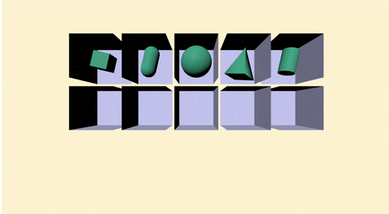

# THREEJS

## 🍝 실습 코드

### 📄 index.html
```html
<!DOCTYPE html>
<html lang="en">
<head>
    <meta charset="UTF-8">
    <meta name="viewport" content="width=device-width, initial-scale=1.0">
    <title>Document</title>
    <script type="importmap">
        {
          "imports": {
            "three": "https://unpkg.com/three@0.160.0/build/three.module.js",
            "three/addons/": "https://unpkg.com/three@0.160.0/examples/jsm/"
          }
        }
        </script>
</head>
<body>
    <canvas id="c_01"></canvas>
    <script src="js_01.js" type="module">
    </script>
</body>
</html>
```
> [!TIP]
> 파일을 분리하는 것으로 좀더 js의 자동완성 기능을 잘 사용할 수 있게 된다


### 📄 js_01.js
```js

import * as THREE from 'three';
import { OrbitControls } from 'three/addons/controls/OrbitControls.js';
function main() {
    const canvas = document.querySelector('#c_01');
    const renderer = new THREE.WebGLRenderer({ antialias: true, canvas: canvas });
    renderer.setSize(window.innerWidth, window.innerHeight, 0.1, 1000)
    const scene = new THREE.Scene()
    scene.background = new THREE.Color(0xFCF2CE)

    const camera = new THREE.PerspectiveCamera(70, window.innerWidth / window.innerHeight, 0.1, 100)
    
    const controls = new OrbitControls(camera, renderer.domElement);
    camera.position.set(0, 0, 10)
    controls.update();

    // 문제 틀
    const test_gm = new THREE.BoxGeometry(2.5, 2.5, 2.5);
    const test_mt = new THREE.MeshStandardMaterial({ color: 0xCFCFFE, side: THREE.BackSide });
    for (let i = 0; i < 10; i++) {
        let row = Math.floor(i / 5);
        let col = i % 5 - 2;
        const test_box = new THREE.Mesh(test_gm, test_mt)
        test_box.position.set(col * 3, row * 3, 0)
        scene.add(test_box)
    }

    // 예시 물체
    const Box_gt = new THREE.BoxGeometry(1, 1, 1);
    const Capsulex_gt = new THREE.CapsuleGeometry(0.5, 1, 4, 10);
    const Sphere_gt = new THREE.SphereGeometry(1, 32, 16);
    const Cone_gt = new THREE.ConeGeometry(1, 2, 4);
    const Cylinde_gt = new THREE.CylinderGeometry(0.5, 0.5, 1.5);
    const ph_mt = new THREE.MeshPhongMaterial({ color: 0x44aa88 });
    const ex_01 = new THREE.Mesh(Box_gt, ph_mt);
    const ex_02 = new THREE.Mesh(Capsulex_gt, ph_mt);
    const ex_03 = new THREE.Mesh(Sphere_gt, ph_mt);
    const ex_04 = new THREE.Mesh(Cone_gt, ph_mt);
    const ex_05 = new THREE.Mesh(Cylinde_gt, ph_mt);
    ex_01.position.set(-6,3,0)
    ex_02.position.set(-3,3,0)
    ex_03.position.set(0,3,0)
    ex_04.position.set(3,3,0)
    ex_05.position.set(6,3,0)
    const ex_list = [ex_01, ex_02, ex_03, ex_04, ex_05]
    scene.add(ex_01, ex_02, ex_03, ex_04, ex_05);

    // 실습 해보기
    // 여기에 코드를 작성해 주세요
    // 아래 박스에 맞게 새로운 도형들을 넣어보세요 
    // 참고 사이트는 https://threejs.org/docs/?q=Geometry


    // 빛 만들기
    const color = 0xFFFFFF;
    const intensity = 3;
    const light = new THREE.DirectionalLight(color, intensity);
    light.position.set(-1, 2, 4);
    scene.add(light);

    // 화면 설정
    function onResize() {
        camera.aspect = window.innerWidth / window.innerHeight;
        camera.updateProjectionMatrix()
        renderer.setSize(window.innerWidth, window.innerHeight);
    }
    window.addEventListener("resize", onResize);

    // 반복 렌더링 작업
    function render(time) {
        time *= 0.001;  // convert time to seconds
        ex_list.map((value,index)=>{
            value.rotation.x = time;
            value.rotation.y = time
            value.rotation.z = time;
        })
        
        renderer.render(scene, camera);
        requestAnimationFrame(render);
    }
    requestAnimationFrame(render);
}
main()
```

상위의 코드를 만들어 확인해보자
5개의 모형을 확인할 수 있다.




## 🍝 코드 분석 

```js
// 1 
const Box_gt = new THREE.BoxGeometry(1, 1, 1);
const Capsulex_gt = new THREE.CapsuleGeometry(0.5, 1, 4, 10);
const Sphere_gt = new THREE.SphereGeometry(1, 32, 16);
const Cone_gt = new THREE.ConeGeometry(1, 2, 4);
const Cylinde_gt = new THREE.CylinderGeometry(0.5, 0.5, 1.5);

// 2
const ph_mt = new THREE.MeshPhongMaterial({ color: 0x44aa88 });

// 3
const ex_01 = new THREE.Mesh(Box_gt, ph_mt);
const ex_02 = new THREE.Mesh(Capsulex_gt, ph_mt);
const ex_03 = new THREE.Mesh(Sphere_gt, ph_mt);
const ex_04 = new THREE.Mesh(Cone_gt, ph_mt);
const ex_05 = new THREE.Mesh(Cylinde_gt, ph_mt);

// 4
ex_01.position.set(-6,3,0)
ex_02.position.set(-3,3,0)
ex_03.position.set(0,3,0)
ex_04.position.set(3,3,0)
ex_05.position.set(6,3,0)
const ex_list = [ex_01, ex_02, ex_03, ex_04, ex_05]

// 5
scene.add(ex_01, ex_02, ex_03, ex_04, ex_05);
```

1. 여러개의 모형을 만들어 할당하는 부분이다   
각각의 모형마다 특정한 인자값이 있으며 ```,```를 눌러 부분적으로 확인이 가능하다
2. 물체의 재질을 만든 부분이다.
3. 모형과 제질을 합쳐 하나의 ```Object```를 만드는 과정이다.  
모든 물체는 ```Object``` 변환 후에 ```THREE.scene```에 추가할 수 있다
4. 특정위치를 지정하는 과정이다. object에는 다양한 메서드가 있으며 필요한 메서드를 확인하여 사용하면 된다.
5. 만들어진 오브젝트들을 하나의 ```scene```에 담는다

!!<이미지 물체를 만들기 위한 2개의 인자를 넣는>

!!<씬에 넣어지는 많은 오브젝트들>


이러한 물체들을 여러가지 만들어보자

## 🚀 Misson 1

> [!IMPORTANT]  
> 상위의 파일을 만들어 물체를 실습

상위의 있는 물체들과 다른 ```Geometry```를 <https://threejs.org/docs/?q=Geometry>사이트를 참조하여 박스안에 넣어주세요~

## 🎖️ TMI

> [!TIP]
> ```Geometry```에는 2가지의 상속자가 존재한다 

---
### 📝 BufferGeometry


<details>
<summary> 🍝 코드 보기</summary>

#### 🍝 Code(EventDispatcher)

```js
class EventDispatcher {
    addEventListener( type, listener ) { }
    hasEventListener( type, listener ) { }
    removeEventListener( type, listener ) { }
    dispatchEvent( event ) { }
}
export { EventDispatcher };
```
</details>

<details>
<summary> 🪄 메써드 보기</summary>

#### 🪄 Method(EventDispatcher)

| Method | Props | Return | Note |
| :-- | :-- | :-- | :-- |
| addEventListener | ( type : String, listener : Function ) | undefined | type - 리스닝할 이벤트의 타입입니다. listener - 이벤트가 작동하면 호출될 함수입니다. |
| hasEventListener | ( type : String, listener : Function ) | Boolean | type - 리스닝할 이벤트의 타입입니다. listener - 이벤트가 작동하면 호출될 함수입니다. |
| removeEventListener | ( type : String, listener : Function ) | undefined | type - 제거될 리스너의 타입입니다. listener - 제거될 리스너 함수입니다. |
| dispatchEvent | ( event : Object ) | undefined | event - 작동하는 이벤트입니다. |

</details>

---
### 📝 BufferGeometry

mesh, 선, 점 기하학펴햔 등의 정보가 있는 구조체입니다.

<details>
<summary> 🍝 코드 보기</summary>

#### 🍝 Code(BufferGeometry)

```js
import { Vector3 } from '../math/Vector3.js';
import { Vector2 } from '../math/Vector2.js';
import { Box3 } from '../math/Box3.js';
import { EventDispatcher } from './EventDispatcher.js';
import { BufferAttribute, Float32BufferAttribute, Uint16BufferAttribute, Uint32BufferAttribute } from './BufferAttribute.js';
import { Sphere } from '../math/Sphere.js';
import { Object3D } from './Object3D.js';
import { Matrix4 } from '../math/Matrix4.js';
import { Matrix3 } from '../math/Matrix3.js';
import * as MathUtils from '../math/MathUtils.js';
import { arrayNeedsUint32 } from '../utils.js';

let _id = 0;

const _m1 = /*@__PURE__*/ new Matrix4();
const _obj = /*@__PURE__*/ new Object3D();
const _offset = /*@__PURE__*/ new Vector3();
const _box = /*@__PURE__*/ new Box3();
const _boxMorphTargets = /*@__PURE__*/ new Box3();
const _vector = /*@__PURE__*/ new Vector3();

class BufferGeometry extends EventDispatcher {
    
    constructor() {
        super();

        this.isBufferGeometry = true;

        Object.defineProperty( this, 'id', { value: _id ++ } );

        this.uuid = MathUtils.generateUUID();

        this.name = '';
        this.type = 'BufferGeometry';

        this.index = null;
        this.attributes = {};

        this.morphAttributes = {};
        this.morphTargetsRelative = false;

        this.groups = [];

        this.boundingBox = null;
        this.boundingSphere = null;

        this.drawRange = { start: 0, count: Infinity };

        this.userData = {};
    }

    getIndex() { }
    setIndex( index ) { }
    getAttribute( name ) { }
    setAttribute( name, attribute ) { }
    deleteAttribute( name ) { }
    hasAttribute( name ) { }
    addGroup( start, count, materialIndex = 0 ) { }
    clearGroups() { }
    setDrawRange( start, count ) { }
    applyMatrix4( matrix ) { }
    applyQuaternion( q ) { }
    rotateX( angle ) { }
    rotateY( angle ) { }
    rotateZ( angle ) { }
    translate( x, y, z ) { }
    scale( x, y, z ) { }
    lookAt( vector ) { }
    center() { }
    setFromPoints( points ) { }
    computeBoundingBox() { }
    computeBoundingSphere() { }
    computeTangents() { }
    computeVertexNormals() { }
    normalizeNormals() { }
    toNonIndexed() { }
    toJSON() { }
    clone() { }
    copy( source ) { }
    dispose() { }

}

export { BufferGeometry };
```
</details>

<details>
<summary> 🎩 프롬프트 보기</summary>

#### 🎩 Properties(BufferGeometry)

| Property | Type | Note |
| :-- | :-- | :-- |
| id | Integer | 인스턴스의 고유한 번호입니다. |
| isBufferGeometry | Boolean | 주어진 객체가 BufferGeometry 유형인지 확인하는 읽기 전용 플래그입니다. |
| uuid | String | 객체 인스턴스의 UUID입니다. 자동으로 할당되며 수정할 수 없습니다. |
| name | String | 인스턴스의 임의 이름입니다. 기본값은 빈 문자열입니다. |
| type | String | 'BufferGeometry' 타입이 써져있다 |
| index | BufferAttribute | 꼭짓점을 여러 개의 삼각형으로 재 사용할 수 있게 해줍니다; 이를 "indexed triangles"를 사용한다고 합니다. 각각의 삼각형은 세 꼭짓점의 인덱스와 연관되어 있습니다. 이 속성은 따라서 각 삼각형 면의 각 꼭짓점의 인덱스를 저장하고 있습니다. 이 속성이 설정되어 있지 않다면, renderer는 세 연속된 위치가 단일 삼각형을 나타낸다고 추정합니다. 기본값은 null 입니다. |
| attributes | Object | 이 해시맵은 설정될 속성의 이름을 id로 가지고 있으며 설정해야 할 buffer 값을 value로 가지고 있습니다. 프로퍼티에 직접 접근하기보다, .setAttribute 및 .getAttribute를 통해 이 기하학 속성에 접근하세요. |
| morphAttributes | Object | BufferAttribute의 해쉬맵은 기하학의 모프 타겟에 대한 세부정보를 담고 있습니다. Note: Once the geometry has been rendered, the morph attribute data cannot be changed. You will have to call .dispose(), and create a new instance of BufferGeometry. |
| morphTargetsRelative | Boolean | 모프 타겟의 행동을 컨트롤하는데에 사용됩니다; true로 설정하면, 모프 타겟 데이터는 absolute positions/normals 대신 relative offsets으로 취급됩니다. 기본값은 false 입니다. |
| groups | Array | 기하학을 그룹으로 나누며 각자의 WebGL 그리기 요청을 통해 렌더링 됩니다. bufferGeometry와 함께 사용되는 재질의 배열을 허용합니다.. |
| boundingBox | Box3 | bufferGeometry의 바운딩 박스이며 .computeBoundingBox()로 계산할 수 있습니다. 기본값은 null입니다. |
| boundingSphere | Sphere | bufferGeometry의 바운딩 스피어이며 .computeBoundingSphere()로 계산할 수 있습니다. 기본값은 null입니다. |
| drawRange | Object | 렌더링할 기하학의 부분을 정의합니다. 직접 설정하면 안되며 .setDrawRange를 사용해야 합니다. 기본 값은 다음과 같습니다. { start: 0, count: Infinity }인덱스가 없는 BufferGeometry의 경우, count는 렌더링할 꼭짓점들의 갯수입니다. 인덱스가 있는 BufferGeometry의 경우, count는 렌더링할 인덱스의 갯수입니다. |
| userData | Object | BufferGeometry에 관한 커스텀 데이터를 저장하는데에 사용될 수 있는 객체입니다. 이 속성은 복제되지 않기 때문에 기능에 대한 참조를 포함하고 있어서는 안됩니다. |
</details>


<details>
<summary> 🪄 메써드 보기</summary>

#### 🪄 Method(BufferGeometry)

| Method | Props | Return | Note |
| :-- | :-- | :-- | :-- |
| .getIndex | ( ) | BufferAttribute | .index 버퍼를 리턴 |
| .setIndex | (  index : BufferAttribute ) | this |.index 버퍼를 설정 |
| .getAttribute | (  name : String ) | BufferAttribute | attribute를 특정 이름과 함께 리턴 |
| .setAttribute | ( name: string, attribute : BufferAttribute ) | this | 기하학에 대한속성 설정 |
| .deleteAttribute | (  name : String ) | BufferAttribute | 특정 이름의 attribute를 전부 삭제 |
| .hasAttribute | (  name : String ) | Boolean | 특정 이름의 속성이 존재하면 true를 리턴 |
| .addGroup | ( start : Integer, count : Integer, materialIndex : Integer ) | undefined | 기하학에 그룹을 추가 |
| .clearGroups | (  ) | undefined | 모든 그룹을 제거
| .setDrawRange | (  start : Integer, count : Integer ) | undefined | .drawRange 프로퍼티를 설정 |
| .applyMatrix4 | ( matrix : Matrix4 ) | this | 꼭짓점 좌표로 매트릭스 변형 |
| .applyQuaternion | ( quaternion : Quaternion ) : this | 꼭짓점 좌표로 쿼터니언 변형 |
| .rotateX | (  radians : Float ) | this | X 축의 기하학을 회전 |
| .rotateY | (  radians : Float ) | this | Y 축의 기하학을 회전 |
| .rotateZ | (  radians : Float ) | this | Z 축의 기하학을 회전 |
| .translate | (  x : Float, y : Float, z : Float ) | this | 기하학을 이동합니다. |
| .scale | (  x : Float, y : Float, z : Float ) | this | 기하학 데이터를 확대/축소 |
| .lookAt | (  vector : Vector3 ) | this | 시점의 월드 벡터 공간의 점을 기준으로 기하학을 면을 회전 |
| .center | ( ) | this | 바운딩 박스를 기준 중앙정렬 |
| .setFromPoints | (  points : Array ) | this | 점 배열로부터 BufferGeometry의 속성을 설정 |
| .computeBoundingBox | ( ) | undefined | 기하학의 바운딩 박스를 계산하고 .boundingBox 속성을 업데이트합니다. |
| .computeBoundingSphere | ( ) | undefined | 기하학의 바운딩 스피어를 계산하고 .boundingSphere 속성을 업데이트합니다. |
| .computeTangents | ( ) | undefined |기하학에 탄젠트 속성을 계산하고 추가합니다. 이 계산은 인덱스가 있는 기하학에만 지원되며 위치, 법선, uv 속성이 정의되어야 합니다. |
| .computeVertexNormals | ( ) | undefined | 면의 법선 평균값을 통해 꼭짓점 법선을 계산 |
| .normalizeNormals | ( ) | undefined | 기하학의 모든 법선 벡터는 1의 크기로 정규화 |
| .toNonIndexed | ( ) | BufferGeometry | 인덱스가 있는 BufferGeometry의 인덱스가 없는 버전을 리턴 |
| .toJSON | ( ) | Object | 버퍼 기하학을 three.js JSON Object/Scene format로 변환 |
| .clone | ( ) | BufferGeometry | 복사본을 생성 |
| .copy | (  bufferGeometry : BufferGeometry ) | this | 대입 복사 |
| .dispose | ( ) | undefined | 메모리에서 객체를 정리합니다. 앱이 동작중인데 BufferGeometry를 삭제하고 싶을 때 호출 |

</details>

> [!WARNING]  
> `BufferGeometry` 메서드는  
> 일반적으로 한 구간에서만 사용되며 루프 구간에서 사용되지 않습니다.
> 일반적인 리얼타임 메쉬 이동은 Object3D.position 를 사용하세요.

도형에 대한 자세한 값들을 한눈에 보고 싶다면 
<https://github.com/liebespaar93/r3f/blob/main/README/RM_6.md> 를 참조하세요