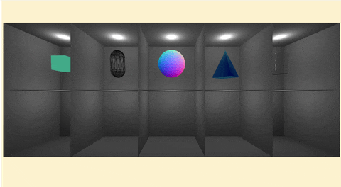

# THREEJS

## 🍝 실습 코드

### 📄 index.html
```html
<!DOCTYPE html>
<html lang="en">
<head>
    <meta charset="UTF-8">
    <meta name="viewport" content="width=device-width, initial-scale=1.0">
    <title>Document</title>
    <script type="importmap">
        {
          "imports": {
            "three": "https://unpkg.com/three@0.160.0/build/three.module.js",
            "three/addons/": "https://unpkg.com/three@0.160.0/examples/jsm/"
          }
        }
        </script>
</head>
<body>
    <canvas id="c_02"></canvas>
    <script src="js_02.js" type="module">
    </script>
</body>
</html>
```
> [!TIP]
> 파일을 분리하는 것으로 좀더 js의 자동완성 기능을 잘 사용할 수 있게 된다

### 📄 js_01.js

```js
import * as THREE from 'three';
import { OrbitControls } from 'three/addons/controls/OrbitControls.js';
import { GUI } from 'three/addons/libs/lil-gui.module.min.js';

function main() {
    const canvas = document.querySelector('#c_02');
    const renderer = new THREE.WebGLRenderer({ antialias: true, canvas: canvas });
    renderer.setSize(window.innerWidth, window.innerHeight, 0.1, 1000)
    const scene = new THREE.Scene()
    scene.background = new THREE.Color(0xFCF2CE)

    const camera = new THREE.PerspectiveCamera(70, window.innerWidth / window.innerHeight, 0.1, 100)
    camera.castShadow = true;
    camera.receiveShadow = true;
    const controls = new OrbitControls(camera, renderer.domElement);
    camera.position.set(0, 0, 10)
    controls.update();

    // 문제 틀
    let light_intensity = 1;
    const gui = new GUI()
    const lightFolder = gui.addFolder('Light')
    function test_box(x, y, z, col, row) {
        const test_gm = new THREE.BoxGeometry(x, y, z);
        const test_mt = new THREE.MeshStandardMaterial({ color: 0xfFfFFf, side: THREE.BackSide });
        test_mt.shadowSide= THREE.DoubleSide;
        for (let i = 0; i < col * row; i++) {
            let r = Math.floor(i / col);
            let c = i % col - row;
            const test_box = new THREE.Mesh(test_gm, test_mt)
            test_box.position.set(c * x, r * y, 0)
            scene.add(test_box)
            const test_pointLight = new THREE.PointLight(0xFFFFFF, light_intensity);
            lightFolder.add(test_pointLight, 'intensity', 0, 3)
            test_pointLight.position.set(c * x, r * y + (y * 0.4), 0);
            scene.add(test_pointLight);
        }
    }
    test_box(4, 4, 4, 5, 2)

    // 예시 물체
    const Box_gt = new THREE.BoxGeometry(1, 1, 1);
    const Capsulex_gt = new THREE.CapsuleGeometry(0.5, 1, 4, 10);
    const Sphere_gt = new THREE.SphereGeometry(1, 32, 16);
    const Cone_gt = new THREE.ConeGeometry(1, 2, 4);
    const Cylinde_gt = new THREE.CylinderGeometry(0.5, 0.5, 1.5);

    const Basic_mt = new THREE.MeshBasicMaterial({ color: 0x44aa88, });
    const Dept_mt = new THREE.MeshDepthMaterial({ color: 0x44aa88, wireframe: true });
    const Normal_mt = new THREE.MeshNormalMaterial({ color: 0x44aa88 });
    const Phong_mt = new THREE.MeshPhongMaterial({ color: 0x44aa88, shininess: 100,emissive:30, emissiveIntensity: 5 });
    const Physical_mt = new THREE.MeshPhysicalMaterial({ roughness:0, metalness: 0, transmission: 1, ior:2});
    
    const ex_01 = new THREE.Mesh(Box_gt, Basic_mt);
    const ex_02 = new THREE.Mesh(Capsulex_gt, Dept_mt);
    const ex_03 = new THREE.Mesh(Sphere_gt, Normal_mt);
    const ex_04 = new THREE.Mesh(Cone_gt, Phong_mt);
    const ex_05 = new THREE.Mesh(Cylinde_gt, Physical_mt);

    ex_01.position.set(-8, 4, 0)
    ex_02.position.set(-4, 4, 0)
    ex_03.position.set(0, 4, 0)
    ex_04.position.set(4, 4, 0)
    ex_05.position.set(8, 4, 0)

    const ex_list = [ex_01, ex_02, ex_03, ex_04, ex_05]
    scene.add(ex_01, ex_02, ex_03, ex_04, ex_05);

    // 실습 해보기
    // 여기에 코드를 작성해 주세요
    // 이전 코드를 가져와 제질을 추가하여 넣어보세요 
    // 참고 사이트는 https://threejs.org/docs/?q=Material


    // 화면 설정
    function onResize() {
        camera.aspect = window.innerWidth / window.innerHeight;
        camera.updateProjectionMatrix()
        renderer.setSize(window.innerWidth, window.innerHeight);
    }
    window.addEventListener("resize", onResize);

    // 반복 렌더링 작업
    function render(time) {
        time *= 0.001;  // convert time to seconds
        ex_list.map((value, index) => {
            value.rotation.x = time;
            value.rotation.y = time
            value.rotation.z = time;
        })
        renderer.render(scene, camera);
        requestAnimationFrame(render);
    }
    requestAnimationFrame(render);
}
main()
```


상위의 코드를 만들어 확인해보자
5개의 모형이 새로운 재질을 확인할 수 있다




> [!NOTE]
> 어떠한 ```Material```의 경우 빛의 영향을 맏지 않는 것을 볼 수 있다.

## 🍝 코드 분석 

```js
// 1
const Basic_mt = new THREE.MeshBasicMaterial({ color: 0x44aa88, });
// 2
const Dept_mt = new THREE.MeshDepthMaterial({ color: 0x44aa88, wireframe: true });
// 3
const Normal_mt = new THREE.MeshNormalMaterial({ color: 0x44aa88 });
// 4
const Phong_mt = new THREE.MeshPhongMaterial({ color: 0x44aa88, shininess: 100,emissive:30, emissiveIntensity: 5 });
// 5
const Physical_mt = new THREE.MeshPhysicalMaterial({ roughness:0, metalness: 0, transmission: 1, ior:2});
```

1. ```MeshBasicMaterial```의 특징을 살펴보면 불을 껏을 떄도 일정한 색을 내기 때문에 구조를 잡을 때 많이 작업을 하는 편이다  하지만 그림자가 보이지 않는다는 단점과 구분선이 뚜렷하지 않은 것으로 보기가 힘들다

2. ```MeshDepthMaterial```의 특징으로는 카메라와 가까울 수록 색이 변한다는 것이다 이것으로 카메라와의 거리에 때른 색을 나타넬 수도 있다

3. ```MeshNormalMaterial```의 특징은 일정한 패턴의 색을 발산하기 때문에 maptexter테스트 하기에 좋다

4. ```MeshPhongMaterial```의 특징은 빛을 적용할 수 있다는 큰 장점이 있고 대부분의 작업을 할 수 있는 프로퍼티를 제공하여 유연하게 사용 하능하다

4. ```MeshPhysicalMaterial```의 특징은 전문가용의 상세한 설정을 할 수 있는 프로프티가 많으며 TexturMap을 적용할 수 있는범위도 넓어 전문가들이 사용하기 좋다


## 🚀 Misson 1

> [!IMPORTANT]  
> 상위의 파일을 만들어 제질을 실습

```Material```을 <https://threejs.org/docs/?q=Material>사이트를 참조하여 나만의 제질을 만들어 표현해 주세요.


## 🎖️ TMI

여러가지 ```Material```를 한눈에 보고싶다면 
🔗 링크 : <https://github.com/liebespaar93/r3f/blob/main/README/RM_7.md>
> [!CAUTION] 
> 예전에 작업한거라 오역이 있을 수 있습니다.
> 오역에 대하여 알려주시면 감사하겠습니다


### 📝 Material

> [!NOTE]  
> 모든 Material에 부모클레스로 존제한다.  
> 통합적인 Material를 관리하는 용도로 사용된다.

#### 🍝 Code(Material)

```js
import { EventDispatcher } from '../core/EventDispatcher.js';
import { FrontSide, NormalBlending, LessEqualDepth, AddEquation, OneMinusSrcAlphaFactor, SrcAlphaFactor, AlwaysStencilFunc, KeepStencilOp } from '../constants.js';
import * as MathUtils from '../math/MathUtils.js';

let _materialId = 0;

class Material extends EventDispatcher {

    constructor() {

        super();

        this.isMaterial = true;

        Object.defineProperty( this, 'id', { value: _materialId ++ } );

        this.uuid = MathUtils.generateUUID();

        this.name = '';
        this.type = 'Material';

        this.blending = NormalBlending;
        this.side = FrontSide;
        this.vertexColors = false;

        this.opacity = 1;
        this.transparent = false;
        this.alphaHash = false;

        this.blendSrc = SrcAlphaFactor;
        this.blendDst = OneMinusSrcAlphaFactor;
        this.blendEquation = AddEquation;
        this.blendSrcAlpha = null;
        this.blendDstAlpha = null;
        this.blendEquationAlpha = null;

        this.depthFunc = LessEqualDepth;
        this.depthTest = true;
        this.depthWrite = true;

        this.stencilWriteMask = 0xff;
        this.stencilFunc = AlwaysStencilFunc;
        this.stencilRef = 0;
        this.stencilFuncMask = 0xff;
        this.stencilFail = KeepStencilOp;
        this.stencilZFail = KeepStencilOp;
        this.stencilZPass = KeepStencilOp;
        this.stencilWrite = false;

        this.clippingPlanes = null;
        this.clipIntersection = false;
        this.clipShadows = false;

        this.shadowSide = null;

        this.colorWrite = true;

        this.precision = null; // override the renderer's default precision for this material

        this.polygonOffset = false;
        this.polygonOffsetFactor = 0;
        this.polygonOffsetUnits = 0;

        this.dithering = false;

        this.alphaToCoverage = false;
        this.premultipliedAlpha = false;
        this.forceSinglePass = false;

        this.visible = true;

        this.toneMapped = true;

        this.userData = {};

        this.version = 0;

        this._alphaTest = 0;

    }

    get alphaTest() { }
    set alphaTest( value ) { }
    onBuild( /* shaderobject, renderer */ ) { }
    onBeforeRender( /* renderer, scene, camera, geometry, object, group */ ) { }
    onBeforeCompile( /* shaderobject, renderer */ ) { }
    customProgramCacheKey() { }
    setValues( values ) { }
    toJSON( meta ) { }
    clone() { }
    copy( source ) { }
    dispose() { }
    set needsUpdate( value ) { }
}

export { Material };
```

#### 🎩 Properties(Material)

| Property | Type | Note |
| :-- | :-- | :-- |
| alphaHash | Boolean | .transparent 또는 .alphaTest 대신 알파 해시 투명도를 활성화합니다. 불투명도가 임의 임계값보다 낮으면 재질이 렌더링되지 않습니다. 무작위화에서는 약간의 입자나 노이즈가 발생하지만 관련 정렬 문제 없이 알파 블렌딩에 근접합니다. TAARenderPass를 사용하면 노이즈를 줄일 수 있습니다. |
| alphaTest | Float | 알파 테스트를 실행할 때 사용할 알파 값을 설정합니다.불투명도가 이 값보다 낮으면 재질이 렌더링되지 않습니다. 기본값은 0 입니다. |
| alphaToCoverage | Boolean | 적용 범위에 대한 알파를 활성화합니다. MSAA-enabled 컨텍스트에서만 사용 가능 합니다 (antialias 파라미터를 true 상태로 renderer가 생성되었을 때를 의미합니다). 기본값은 false 입니다. |
| blendDst | Integer | 블렌딩 대상. 기본값은 OneMinusSrcAlphaFactor입니다. 가능한 모든 값에 대한 대상 요소 상수를 참조하세요. 효과가 있으려면 재질의 블렌딩을 CustomBlending으로 설정해야 합니다. |
| blendDstAlpha | Integer | .blendDst의 투명도입니다. null인 경우 .blendDst 값을 사용합니다. 기본값은 null입니다. |
| blendEquation | Integer | 블렌딩을 적용할 때 사용할 블렌딩 방정식입니다. 기본값은 AddEquation입니다. 가능한 모든 값은 혼합 방정식 상수를 참조하세요.효과가 있으려면 재질의 블렌딩을 CustomBlending으로 설정해야 합니다. |
| blendEquationAlpha | Integer | .blendEquation의 투명성입니다. null인 경우 .blendEquation 값을 그대로 사용합니다. 기본값은 null입니다.|
| blending | Blending | 이 재질로 개체를 표시할 때 사용할 혼합입니다. 사용자 정의 blendSrc, blendDst 또는 blendEquation를 사용하려면 CustomBlending을 설정해야 합니다. 가능한 모든 값은 혼합 모드 상수를 참조하세요. 기본값은 NormalBlending입니다. |
| blendSrc | Integer | 소스 통합. 기본값은 SrcAlphaFactor입니다. 가능한 모든 값에 대해서는 참조된 소스 상수를 참조하세요. 효과가 있으려면 재질의 블렌딩을 CustomBlending으로 설정해야 합니다. |
| blendSrcAlpha | Integer | .blendSrc의 투명도입니다. null인 경우 .blendSrc 값을 사용합니다. 기본값은 null입니다. |
| clipIntersection | Boolean | 합집합이 아닌 교차점만 잘리도록 평면 자르기의 동작을 변경합니다. 기본값은 false입니다. |
| clippingPlanes | Array | 월드 좌표공간에서 THREE.Plane 객체로 지정된 사용자 정의 클리핑 평면.이러한 평면은 이 재질이 부착된 객체에 적용됩니다. 평면까지의 부호 있는 거리가 음수인 공간의 점은 잘립니다 (렌더링되지 않음). WebGLRenderer가 필요합니다.localClippingEnabled가 true로 설정되었습니다. WebGL / clipping /intersection 예제를 참조하세요. 기본값은 null입니다. |
| clipShadows | Boolean | 이 재질에 지정된 클리핑 평면에 따라 그림자를 클리핑할지 여부를 정의합니다. 기본값은 false입니다. |
| colorWrite | Boolean |재질의 색상을 렌더링할지 여부입니다. 이는 메쉬의 renderOrder 속성과 함께 사용되어 다른 개체를 가리는 보이지 않는 개체를 만들 수 있습니다. 기본값은 true입니다. |
| defines | Object | shader가 defines에 적용되도록 커스텀 합니다. 이는 키/값 쌍과 함께 고정 객체 형태로 전달됩니다. { MY_CUSTOM_DEFINE: '' , PI2: Math.PI * 2 }.  쌍은 vertex 와 fragment shaders 모두에게 정의됩니다. 기본값은 정의되지 않았습니다. |
| depthFunc | Integer | 어떤 depth 함수를 사용할지. 기본값은 LessEqualDepth입니다. 가능한 모든 값은 depth mode 상수를 참조하세요.. |
| depthTest | Boolean | 이 머티리얼을 렌더링할 때 depth 테스트를 활성화할지 여부입니다. 기본값은 true입니다. |
| depthWrite | Boolean | 이 재질을 렌더링하는 것이 깊이 버퍼에 영향을 미치는지 여부. 기본값은 true입니다. |
| forceSinglePass | Boolean | 양면 투명 개체를 단일 패스로 렌더링해야 하는지 여부. 기본값은 false입니다. |
| isMaterial | Boolean | 주어진 객체가 Material 유형인지 확인하는 읽기 전용 플래그입니다. |
| stencilWrite | Boolean | 스텐실(생성 틀) 버퍼에 대해 스텐실 작업이 수행되는지 여부입니다. 스텐실 버퍼에 대해 쓰기 또는 비교를 수행하려면 이 값이 true여야 합니다. 기본값은 false입니다. |
| stencilWriteMask | Integer | 스텐실 버퍼에 쓸 때 사용할 비트 마스크입니다. 기본값은 0xFF입니다. |
| stencilFunc | Integer | 사용할 스텐실 비교 기능입니다. 기본값은 AlwaysStencilFunc입니다. 가능한 모든 값은 스텐실 함수 상수를 참조하세요. |
| stencilRef | Integer | 스텐실 비교 또는 스텐실 작업을 수행할 때 사용할 값입니다. 기본값은 0입니다. |
| stencilFuncMask | Integer | 스텐실 버퍼와 비교할 때 사용할 비트 마스크입니다. 기본값은 0xFF입니다. |
| stencilFail | Integer | 비교 함수가 false를 반환할 때 수행할 스텐실 작업입니다. 기본값은 KeepStencilOp입니다. 가능한 모든 값은 스텐실 작업 상수를 참조하세요. |
| stencilZFail | Integer | 비교 함수가 true를 반환하지만 깊이 테스트가 실패하는 경우 수행할 스텐실 작업입니다. 기본값은 KeepStencilOp입니다. 가능한 모든 값은 스텐실 작업 상수를 참조하세요. |
| stencilZPass | Integer | 비교 함수가 true를 반환하고 깊이 테스트가 통과할 때 수행할 스텐실 작업입니다. 기본값은 KeepStencilOp입니다. 가능한 모든 값은 스텐실 작업 상수를 참조하세요. |
| id | Integer | 이 머티리얼 인스턴스의 고유 번호입니다.|
| name | String | 개체의 선택적 이름입니다(고유할 필요는 없음). 기본값은 빈 문자열입니다. |
| needsUpdate | Boolean | 재질을 다시 컴파일해야 함을 지정합니다. |
| opacity | Float | 재질의 투명도를 나타내는 0.0 - 1.0 범위의 부동 소수점입니다. 값이 0.0이면 완전히 투명하고, 1.0이면 완전히 불투명합니다. 제질의 transparent가 true로 설정되지 않은 경우, 재질은 완전히 불투명한 상태로 유지되며 이 값은 색상에만 영향을 미칩니다. 기본값은 1.0입니다. |
| polygonOffset | Boolean | 폴리곤 오프셋 사용 여부. 기본값은 false입니다. 이는 GL_POLYGON_OFFSET_FILL WebGL 기능에 해당합니다. |
| polygonOffsetFactor | Integer | 폴리곤 오프셋 계수를 설정합니다. 기본값은 0입니다. |
| polygonOffsetUnits | Integer | 폴리곤 오프셋 단위를 설정합니다. 기본값은 0입니다. |
| precision | String | 이 재질에 대한 렌더러의 기본 정밀도를 재정의합니다. "높음", "중간" 또는 "낮음"일 수 있습니다. 기본값은 null입니다. |
| premultipliedAlpha | Boolean | 알파(투명도) 값을 미리 곱할지 여부입니다. 차이점의 예는 WebGL / Materials / Physical / Transmission을 참조하세요. 기본값은 false입니다. |
| dithering | Boolean | 밴딩 모양을 제거하기 위해 색상에 디더링을 적용할지 여부입니다. 기본값은 false입니다. |
| shadowSide | Integer | 그림자를 투사하는 면의 측면을 정의합니다. 설정되면 THREE.FrontSide, THREE.BackSide 또는 THREE.DoubleSide가 될 수 있습니다. 기본값은 null입니다. null 인 경우 측면 투사 그림자는 다음과 같이 결정됩니다.  { Material.side, Side casting shadows } = { THREE.FrontSide : back side, THREE.BackSide : front side, THREE.DoubleSide : both sides} |
 side | Integer | front, back 또는 둘 다 중 렌더링할 면을 정의합니다. 기본값은 THREE.FrontSide 입니다. 다른 옵션은 THREE.BackSide 또는 THREE.DoubleSide 입니다. |
| toneMapped | Boolean | 렌더러의 톤 매핑 설정에 따라 이 재질이 톤 매핑되는지 여부를 정의합니다. 기본값은 true입니다. |
| transparent | Boolean | 이 재질이 투명한지 여부를 정의합니다. 투명 객체는 특별한 처리가 필요하고 불투명 객체 다음에 렌더링되므로 이는 렌더링에 영향을 미칩니다. true로 설정하면 불투명도 속성을 설정하여 재질이 투명한 정도가 제어됩니다. 기본값은 false입니다. |
| type | String | 값은 'Material' 문자열입니다. 이는 변경되어서는 안 되며 장면에서 이 유형의 모든 개체를 찾는 데 사용할 수 있습니다. |
| uuid | String | 이 머티리얼 인스턴스의 UUID입니다. 자동으로 할당되므로 편집하면 안 됩니다. |
| version | Integer | 이는 0부터 시작하여 .needsUpdate가 true로 설정된 횟수를 계산합니다. |
| vertexColors | Boolean | 정점 색상 지정이 사용되는지 여부를 정의합니다. 기본값은 false입니다. 엔진은 3개(RGB) 또는 4개(RGBA) 구성요소 색상 버퍼 속성이 사용되는지 여부에 따라 RGB 및 RGBA 정점 색상을 지원합니다. |
| visible | Boolean | 이 재질이 표시되는지 여부를 정의합니다. 기본값은 true입니다. |
| userData | Object | 머티리얼에 대한 사용자 정의 데이터를 저장하는 데 사용할 수 있는 객체입니다. 함수는 복제되지 않으므로 함수에 대한 참조를 보유하면 안 됩니다. 기본값은 빈 Object {}입니다. |

#### 🪄 Method(Material)

| Method | Props | Return | Note |
| :-- | :-- | :-- | :-- |
| clone | ( ) | Material | 이 재질과 동일한 매개변수를 가진 새 재질을 반환합니다. |
| copy | ( material : material ) | this | 전달된 material의 매개변수를 이 material에 복사합니다. |
| dispose | ( ) | undefined | 이 인스턴스에서 할당한 GPU 관련 리소스를 해제합니다. 이 인스턴스가 앱에서 더 이상 사용되지 않을 때마다 이 메서드를 호출하세요. 머티리얼 텍스처는 Texture의 dispose() 메서드를 통해 삭제해야 합니다. |
| onBeforeCompile | ( shader : Shader, renderer : WebGLRenderer ) | undefined | shader 프로그램이 컴파일되기 직전에 실행되는 선택적 콜백입니다. 이 함수는 shader 소스 코드를 매개변수로 사용하여 호출됩니다. 내장된 재질을 수정하는 데 유용합니다. 속성과 달리 콜백은 .clone(), .copy() 및 .toJSON()에서 지원되지 않습니다. |
| customProgramCacheKey | ( ) | String | onBeforeCompile을 사용하는 경우 이 콜백을 사용하여 onBeforeCompile에 사용된 설정 값을 식별할 수 있으므로 three.js는 필요에 따라 캐시된 shader를 재사용하거나 이 자료에 대한 shader를 다시 컴파일할 수 있습니다. 속성과 달리 콜백은 .clone(), .copy() 및 .toJSON()에서 지원되지 않습니다. |
| setValues | ( values : Object ) | undefined | 값 - 매개변수가 포함된 컨테이너입니다. 값을 기반으로 속성을 설정합니다. |

<details>
<summary>🚀 참고 사이트</summary>

---

| Three.js 공식 사이트 | Three.js 깃허브|
| :--: | :--: |
| [](https://threejs.org/docs/#api/en/materials/Material) | [](https://github.com/mrdoob/three.js/blob/master/src/materials/Material.js) |
|🔗 Link : <https://threejs.org/docs/#api/en/materials/Material> | 🔗 Link : <https://github.com/mrdoob/three.js/blob/master/src/materials/Material.js> |

</details>

